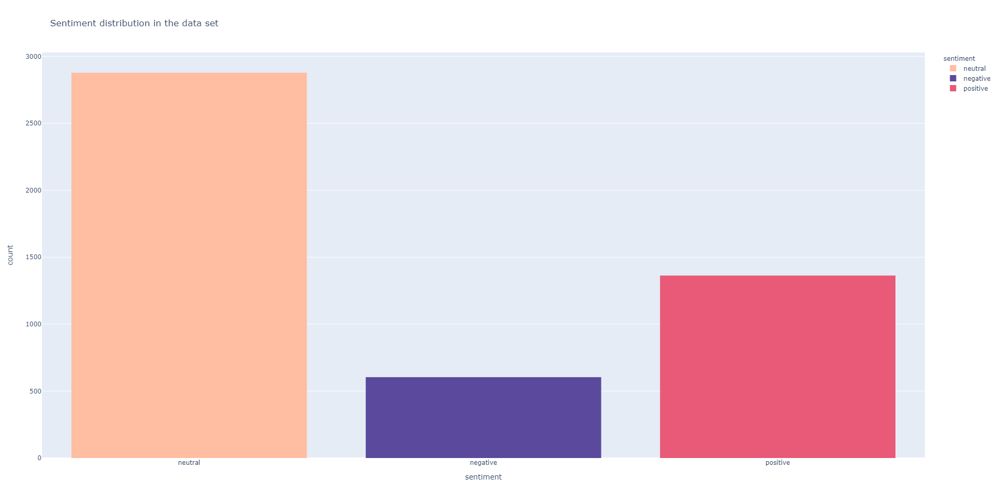

# Financial news - looking for the sentiment.

Sentiment analysis is a huge part of brands connecting with customer needs but also analysing the world around us. In this project I'm going to show you how sentiment analysis can be used on financial news. If we extract headlines and put them against users who clicked on them, how long they spend on reading and if they interacted in any way (liked, commented), we can also create recommendation systems and much more. This time I'm only going to focus on the first task I mentioned.


## The goal & the data

Our main goal is to distinguish between positive, neutral and negative sentiment. We are working with a data set from Kaggle that has two columns: the sentiment and the headline. Below you can see an example of the data. Looking at the best Kaggle notebooks, they achieve validation accuracy around 80%, so I will be aiming to score that or higher.

| Sentiment | Headline                                                     |
| --------- | ------------------------------------------------------------ |
| neutral   | Technopolis plans to develop in stages an area of no less than 100,000 square meters in order to host.. |
| positive  | With the new production plant the company would increase its capacity to meet the expected increase.. |
| negative  | The international electronic industry company Elcoteq has laid off tens of employees from its Tallin... |


## Short analysis for insights

Before jumping to the technical stuff, I'd really like to explore the dataset. Sometimes you can find interesting patterns and information in places that you wouldn't think about. In this case I'm simply going to run trough basic tests and plot creation like making word clouds, finding most used words by category and looking up the statistics of the data set.

### 1) The structure

```python
(4845, 2)
```



```Python
neutral : 59.4%
positive : 28.13%
negative : 12.47%
```

As we can see on the plot above we are dealing with highly disproportional data set. Most of the headlines we're dealing with are neutral, and there is fewer negative ones. Since we're using neural networks, hopefully they can pick up on the differences but we might need to so a little bit of under or over sampling to fight it if there's some issues.


## 2) What are the news about?

I'm also going to showcase a few plots that go more in-depth into the data set and present the most informative parts of it.


### Distribution of words


### Correlation between headline properties


### Most frequent words


## Preparing the data


## Creating a LSTM model

When it comes to NLP, we want to use a Recurrent Neural Network (RNN) to help us with an input that is changing in length.


## Evaluation

